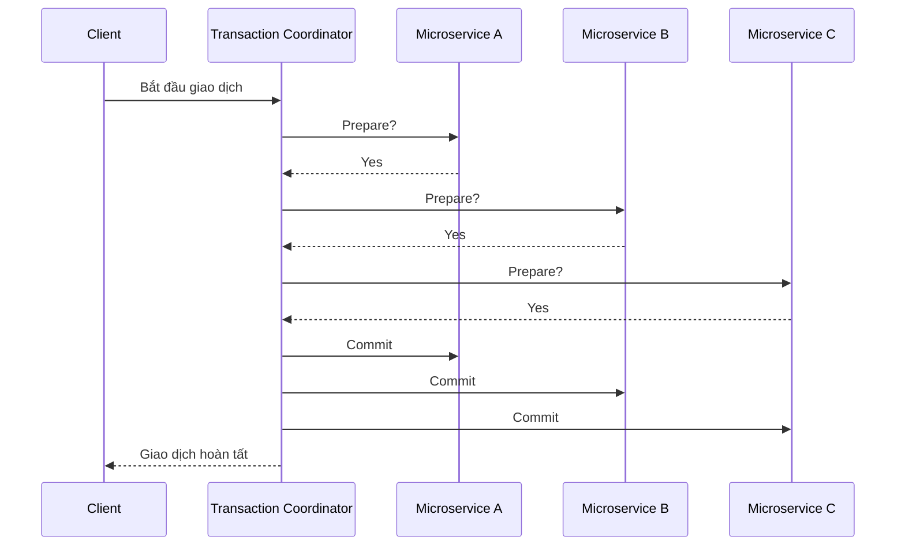
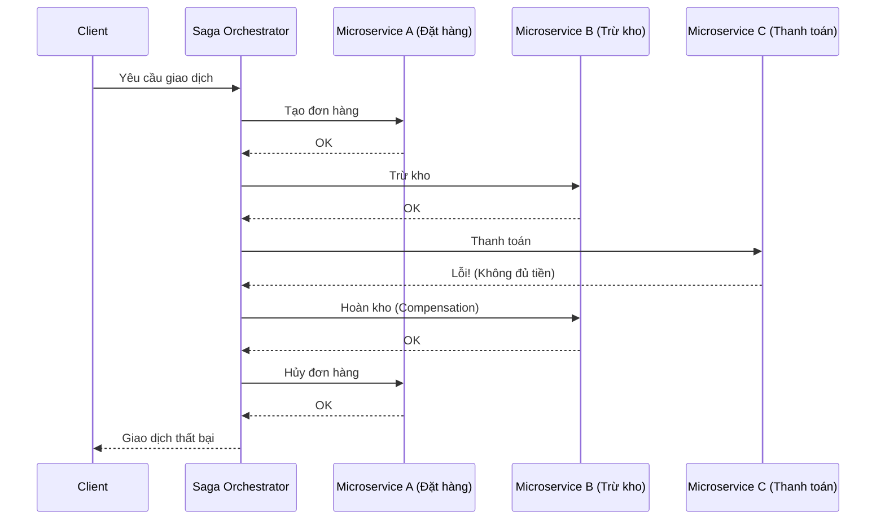
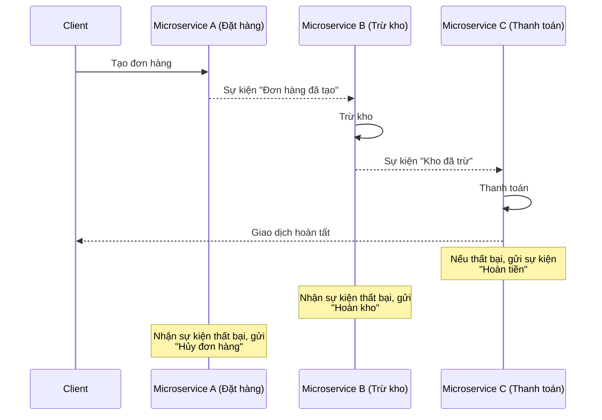

# Đảm bảo toàn vẹn dữ liệu trong giao dịch phân tán 

Trong hệ thống microservices, quản lý giao dịch (transaction) là một thách thức lớn do tính phân tán của các dịch vụ. Hai phương pháp phổ biến để xử lý giao dịch phân tán là **2-Phase Commit (2PC)** và **Saga**.  

## 1. **2-Phase Commit (2PC) – Giao dịch phân tán có cam kết hai pha**  

**Mô hình:**  
2PC là một giao thức nhất quán mạnh mẽ giúp đảm bảo tất cả các dịch vụ tham gia vào một giao dịch đều cam kết hoặc hủy bỏ giao dịch đồng thời.  

**Quy trình:**  
- **Pha 1 – Chuẩn bị (Prepare/ Voting phase):**  
  - Một thành phần trung tâm gọi là **Transaction Coordinator (Điều phối viên giao dịch)** gửi yêu cầu chuẩn bị giao dịch đến tất cả các dịch vụ liên quan.  
  - Các dịch vụ kiểm tra xem chúng có thể thực hiện giao dịch hay không, rồi phản hồi (Yes/No).  
- **Pha 2 – Cam kết (Commit phase):**  
  - Nếu tất cả phản hồi là **Yes**, điều phối viên sẽ gửi lệnh **Commit** để tất cả dịch vụ thực hiện giao dịch.  
  - Nếu có bất kỳ dịch vụ nào phản hồi **No**, điều phối viên gửi lệnh **Rollback** để tất cả dịch vụ hủy bỏ giao dịch.  

**Ưu điểm:**  
✅ Đảm bảo tính nhất quán tuyệt đối giữa các microservices.  
✅ Không có trường hợp dữ liệu bị mất hoặc trạng thái không xác định.  

**Nhược điểm:**  
❌ Hiệu suất kém vì phải giữ khóa tài nguyên cho đến khi giao dịch hoàn tất.  
❌ Điểm tập trung (single point of failure) vì phụ thuộc vào Transaction Coordinator.  
❌ Không phù hợp với hệ thống microservices quy mô lớn do ảnh hưởng đến tính mở rộng (scalability).  

---

## 2. **Saga – Giao dịch bù trừ (Compensating Transactions)** 

**Sơ đồ Saga (Orchestration)**

**Sơ đồ Saga (Choreography)**

**Mô hình:**  
Saga là một chiến lược xử lý giao dịch phân tán theo hướng sự kiện (event-driven). Thay vì khóa tài nguyên như 2PC, Saga chia nhỏ giao dịch thành nhiều bước nhỏ, mỗi bước được thực hiện như một giao dịch độc lập có thể bù trừ nếu có lỗi xảy ra.  

**Quy trình:**  
Có 2 cách triển khai chính của Saga:  
1. **Choreography (Điều phối phân tán)**:  
   - Các microservices tự quản lý giao dịch bằng cách lắng nghe và phản hồi sự kiện.  
   - Ví dụ: Đặt hàng → Trừ kho → Thanh toán → Giao hàng. Nếu thanh toán thất bại, dịch vụ gửi sự kiện hoàn kho.  
   
2. **Orchestration (Điều phối tập trung)**:  
   - Một dịch vụ trung tâm (Saga Coordinator) điều phối toàn bộ quy trình giao dịch bằng cách gọi tuần tự từng microservice.  
   - Nếu có lỗi, nó gửi yêu cầu bù trừ để hủy bỏ các bước đã thực hiện trước đó.  

**Ưu điểm:**  
✅ Hoạt động không đồng bộ, giúp tăng hiệu suất và khả năng mở rộng.  
✅ Không giữ khóa tài nguyên lâu, tránh ảnh hưởng đến hiệu suất hệ thống.  
✅ Linh hoạt, phù hợp với môi trường microservices có số lượng dịch vụ lớn.  

**Nhược điểm:**  
❌ Phức tạp hơn so với 2PC do cần thiết kế các bước bù trừ (compensating transactions).  
❌ Không đảm bảo tính nhất quán ngay lập tức (eventual consistency thay vì strong consistency).  
❌ Cần cơ chế quản lý lỗi phức tạp để đảm bảo các giao dịch không bị mắc kẹt ở trạng thái trung gian.  

## 4. **Khi nào nên sử dụng 2PC và khi nào nên dùng Saga?**
- **Sử dụng 2PC khi:**
  - Cần đảm bảo tính nhất quán mạnh (Strong Consistency).
  - Số lượng dịch vụ tham gia vào giao dịch ít.
  - Có thể chấp nhận hiệu suất thấp để đổi lấy tính nhất quán cao (VD: giao dịch ngân hàng).  

- **Sử dụng Saga khi:**
  - Hệ thống có nhiều microservices và yêu cầu khả năng mở rộng.
  - Có thể chấp nhận tính nhất quán theo thời gian (Eventual Consistency).
  - Cần hiệu suất cao và xử lý không đồng bộ (VD: thương mại điện tử, đặt vé, chuỗi cung ứng).
 

